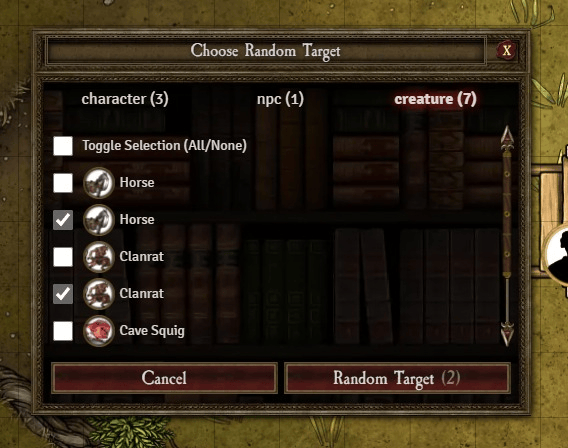

# Random Target

This module adds a tool for quickly selecting a random target. Once activated it will list all tokens in the current scene grouped by type where you can pre-select which tokens are eligible for the random selection.

# Installation / Usage

1. Install the package following the standard Foundry procedure.
2. Open the **Random Target** macro compendium.
3. Use the **Choose Random Target** macro to activate the tool.

# Supported Systems

While this package should work without problems with most systems, it has been visually optimized for:

- [DnD5e](https://foundryvtt.com/packages/dnd5e)
- [Warhammer Fantasy Roleplay 4th Edition](https://foundryvtt.com/packages/wfrp4e)
- [Forbidden Lands](https://foundryvtt.com/packages/forbidden-lands)

Please reach out if you'd like to optimize it for any other system.
