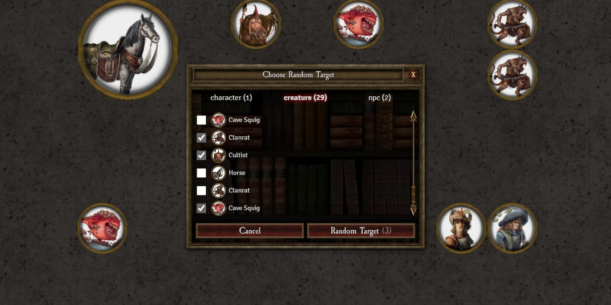

# Random Target

This module adds a tool for quickly selecting a random target. Once activated it will list all tokens in the current scene grouped by type where you can pre-select which tokens are eligible for the random selection.

# Installation / Usage

1. Install the package following the [standard Foundry procedure](https://foundryvtt.wiki/en/basics/Modules).
2. Open the **Random Target** macro compendium.
3. Use the **Choose Random Target** macro to activate the tool.

# Upgrading

If you are having issues after upgrading the module please follow this instructions:

1. **Uninstall** the module completely by removing it from your server
2. Install the **latest version** of the module
3. Delete the **Random Target** macro from your toolbar
4. Import the macro again from the **Random Target** macro compendium

# Supported Systems

While this module should work without problems with most systems, it has been tested and visually optimized for:

- [DnD5e](https://foundryvtt.com/packages/dnd5e)
- [Pathfinder Second Edition (Official)](https://foundryvtt.com/packages/pf2e)
- [Warhammer Fantasy Roleplay 4th Edition](https://foundryvtt.com/packages/wfrp4e)
- [Forbidden Lands](https://foundryvtt.com/packages/forbidden-lands)
- [Call of Cthulhu 7th edition (Unofficial)](https://foundryvtt.com/packages/CoC7)
- [Robert E. Howard's CONAN: Adventures In An Age Undreamed Of](https://foundryvtt.com/packages/conan2d20)

Please [reach out](https://github.com/mcavallo/foundry-vtt-random-target/issues) if you'd like to optimize it for any other system.

# Support the Project

Please consider [supporting me](https://www.buymeacoffee.com/ikindred) if you find this module useful.

